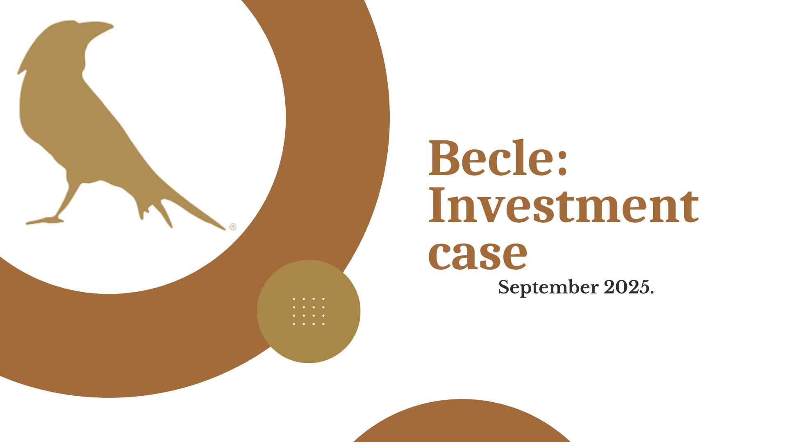
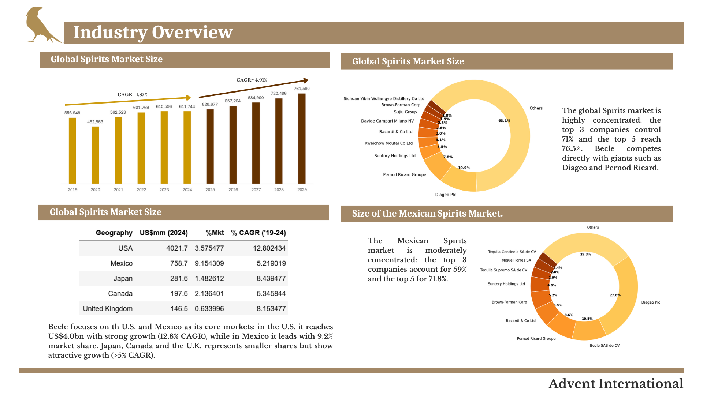

# 📈 Becle Investment Case  
### Programa Private Equity Practice (PEP) – Advent International | 2025  

---

## Descripción del proyecto:
Este proyecto forma parte del programa **Private Equity Practice (PEP)** de **Advent International**. En este caso el enfoque fue en el análisis de oportunidades de inversión y evaluación de empresas del sector de bebidas espirituosas.

El caso se centró en **Becle, S.A.B. de C.V.**, empresa líder en la producción y distribución de tequila a nivel internacional.  
El objetivo fue analizar su estructura financiera, crecimiento de ingresos y oportunidades de expansión.

---

## 🧮 Metodología y herramientas
El análisis fue desarrollado en **Python** (por preferencia de la autora del código), utilizando las siguientes bibliotecas:

- `pandas` → manejo y limpieza de datos  
- `numpy` → cálculos de tasas y promedios (CAGR)  
- `matplotlib` y `seaborn` → visualización de datos  

El análisis completo puede consultarse en el siguiente notebook:  
📓 [Abrir notebook](https://github.com/LuzSantana/Python-Advent-International-PEP--Becle-Investment-Case-/blob/main/PEP%20Advente%20International%20Becle%20Investment%20Case%20.ipynb)

---

## 📊 Principales resultados
- El mercado global de bebidas espirituosas muestra un **CAGR estimado del 4.9% hacia 2029**.  
- Becle mantiene una **alta concentración de ingresos en tequila (71.9%)**.  
- **México y EE.UU.** representan más del 80% del total de ventas.  
- Existen **oportunidades de crecimiento** ligadas a diversificación de productos y expansión internacional.  

---

## 🖼️ Visualizaciones
Ejemplos de gráficos generados en Python:

  

  

  

---

## 🎓 Créditos
**Autora:** Luz Santana  
**Programa:** Private Equity Practice (PEP) – Advent International  
**Fecha:** Septiembre 2025  

---
